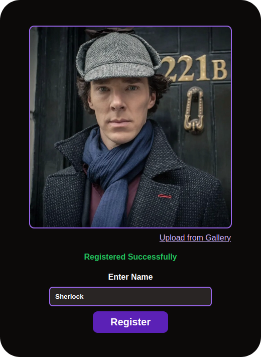
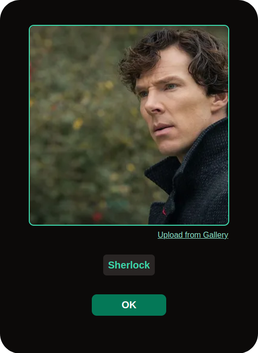

# facecog
simple app to register and recognise face using DeepFace


## Overview
It comes with the two simple features: Register and Recognize. In the 'Register Face' option, one may click his/her photo from the web/front camera or may select an image from the gallery and enter the name of the person. This photo is analyzed by DeepFace, and a cropped image is stored along with the entered name. Now, when the user submits similar images of the registered person, the face is recognized, and the name is displayed.

<p align="center">


</p>

## Installisation
#### 1. Fetch the code
```bash
git clone https://github.com/s0ubhik/facecog
cd facecog
```

#### 2. Configure `venv`
```
python3 -m venv venv
source venv/bin/activate
```

#### 3. Install Dependecies
```
pip install -r requirements.txt
```

#### 4. Start Flask
```
flask run -p 8080
```

#### 5. Open Browser 
Open the following link in the browser
```
http://127.0.0.1:8080
```

## Building Docker Image
#### 1. Build Docker image
```bash
docker build -t facecog .
```

#### 2. Start Docker image
Now that our image is built we need to start the image, note that in the following command `-p` paramater is used to tunnel a port from the container to your machine `8080:5000` means the `5000` port of the image is tunneled to `8080` port of your computer
```
docker run -p 8080:5000 -i facecog
```


## How does it work?
```
.
├── app.py
├── faces.db    ( Names along with hashes )
├── dataset/    ( Image dataset )
├── static/
└── templates/
```

#### Register Face
When a user hits register a HTTP POST request is sent to `/api/register` that contains two field the `name` of the user and the base64 url-encoded `image`.

On the server-side the image is passed to `DeepFace.extarct_faces` which retruns the array of cropped faces found, now we check for few condition where is there is a face or there are multiple faces.

After this we generate a `md5` hash of the cropped face, and sa store the cropped face as jpg in the `dataset/` folder i.e `dataset/<hash>.jpg`, now store the name of the user along with this hash in the tables `faces` of `faces.db` 

`id` | `name`
--|--
`758db7ed77b618a676404e279ddd57d1` | Sherlock
`310519ed47f0219474d1467290ee4361` | Jack
`514b35accafafc6c631538864100a374` | Sherlock
`df41a552c1fde775a232e266b96fc0da` | Alice


#### Recognise Face
When a user hits recognise a HTTP POST request is sent to `/api/recognise` with the base64 url-encoded `image` of the user.

On the server-side the image is passed to `DeepFace.find` along with the directory of dataset, this method returns as arraw of matched faces along with their filepath and a value that represents the score of mathc, out of them we only that the first entry with best score.

Now we extract the hash from the file path and fetch the corresponding user.

## License
Distributed under the MIT License. See `LICENSE` for more information.
